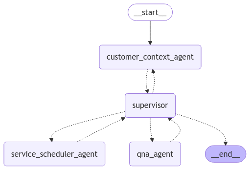
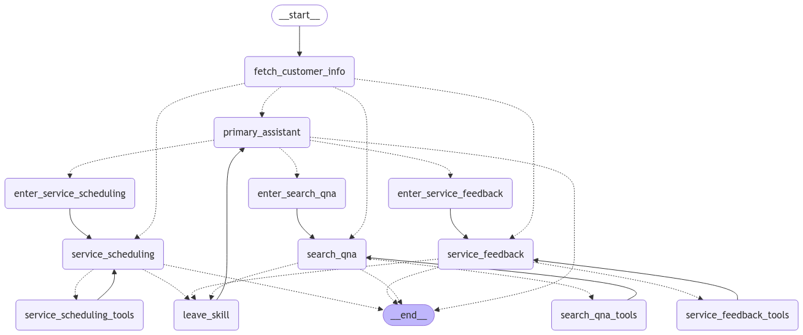

# Contoso Motocorp Service Bot

This repository contains the source code for the Contoso Motocorp Service Bot, implemented as a multi agent system using `langGraph`.
It helps customers schedule service appointments, provide feedback, and answer queries related to their vehicles.

## Project Structure

## Files and Directories

### Root Directory

- **.env**: Environment variables for database and API configurations.
- **.gitignore**: Specifies files and directories to be ignored by Git.
- **analyze_feedback.py**: Sample code to perform vector search on the Integrated Vector database - Azure SQL Database - to query based on user feedback
- **bot-app-v1.py**: Uses multi agent with a supervisor routing calls to each of them. All user communication is routed via supervisor
- **bot-app-v2.py**: Hierarchical, multi agent system. Each Agent is powered by LLM and can make decisions. User communication happens directly
- **readme.md**: This file.
- **requirements.txt**: List of Python dependencies required for the project.

### Scripts Directory

- **analyze_feedback_sp.sql**: SQL script for the `AnalyzeFeedback` stored procedure.
- **capture-service-rating.sql**: SQL script for the `InsertServiceFeedback` stored procedure.
- **create_service_schedule_sp.sql**: SQL script for the `CreateServiceSchedule` stored procedure. 
- **db-create.sql**: SQL script to create and populate the database tables that can be used to run and demo this application

### Search data setup

The folder documents contains a PDF which is the user manual of Hero Honda HF100 Bike from the internet. Multimodal data extraction was used to extract insights from the text and images in this document, and the resulting enriched textual data is generated, and saved to file 'heromotocorp-sample-understood.md'
This could be uploaded to Azure AI Search, an index created and used in the application, as the basis on which customer queries on their product purchased can be answered

### Service Requests Directory

These are called by different Agents in the application

- **db_tools.py**: Contains database utility functions and tools. 
- **search_tools.py**: Contains tools for performing search-based Q&A.

## Setup

1. **Clone the repository**:
    ```sh
    git clone <repository-url>
    cd <repository-directory>
    ```

2. **Create a virtual environment**:
    ```sh
    python -m venv venv
    source venv/bin/activate  # On Windows, use `venv\Scripts\activate`
    ```

3. **Install dependencies**:
    ```sh
    pip install -r requirements.txt
    ```

4. **Set up environment variables**:
    - Copy the [.env](http://_vscodecontentref_/13) file and update the values with your database and API credentials.

5. The .env file

```
AZURE_OPENAI_ENDPOINT="https://<>.openai.azure.com/"
AZURE_OPENAI_API_KEY=""
AZURE_OPENAI_DEPLOYMENT_NAME="gpt-4o"
AZURE_OPENAI_EMBEDDINGS_DEPLOYMENT_NAME="text-embedding-ada-002"
API_VERSION="2023-08-01-preview"
API_TYPE="azure"
az_db_server = "<>.database.windows.net"
az_db_database = "<>"
az_db_username = "<>"
az_db_password = "<>"


ai_search_url = "https://<>.search.windows.net"
ai_search_key = "<>"
ai_index_name = "contoso-motocorp-index"
ai_semantic_config = "contoso-motocorp-config"
```

## Usage

### Running the Bot

To run the bot application, execute the following command:

```sh
python bot-app-v2.py
```

### Analyzing Feedback
To analyze customer feedback, run:

```sh
python analyze_feedback.py
```

### Database Setup

To set up the database, execute the SQL scripts in the scripts directory in the following order:

- db-create.sql: Creates and populates the database tables.
- create_service_schedule_sp.sql: Creates the CreateServiceSchedule stored procedure.
- capture-service-rating.sql: Creates the InsertServiceFeedback stored procedure.
- analyze_feedback_sp.sql: Creates the AnalyzeFeedback stored procedure.


### Tools and Utilities
#### Database Tools

- fetch_customer_information: Retrieves customer information from the database
- get_available_service_slots: Retrieves available service slots.
- create_service_appointment_slot: Creates a service appointment slot.
- store_service_feedback: Stores customer feedback for a service appointment.


### Graph comprising the Agents

bot-app-v1.py -> implements a simple, multi agent solution using `langGraph`. Here the supervisor agent routes to the other agents, who merely use the tool and revert to the supervisor agent, before that is relayed to the user




bot-app-v2.py -> Implements a full blown multi agent solution using `langGraph`. This has been adapted based on a similar sample in the Travel domain [here](https://langchain-ai.github.io/langgraph/tutorials/customer-support/customer-support/#conversation).Here the supervisor agents routes to the other agents, each of which are powered by an LLM and can make decisions of their own. They choose to use the different tools they have access to, can respond to the user directly and not have to go through the supervisor, when in a context in the conversation. Each of the Agents have a system prompt that determines their behavior and purpose.


